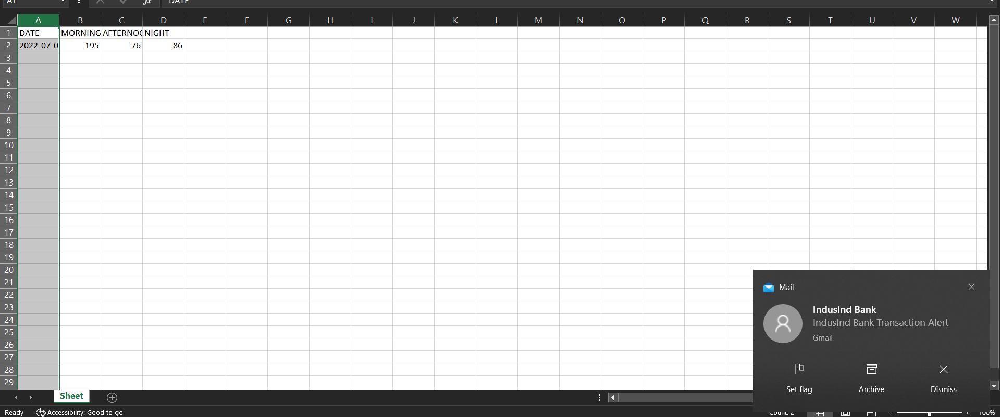
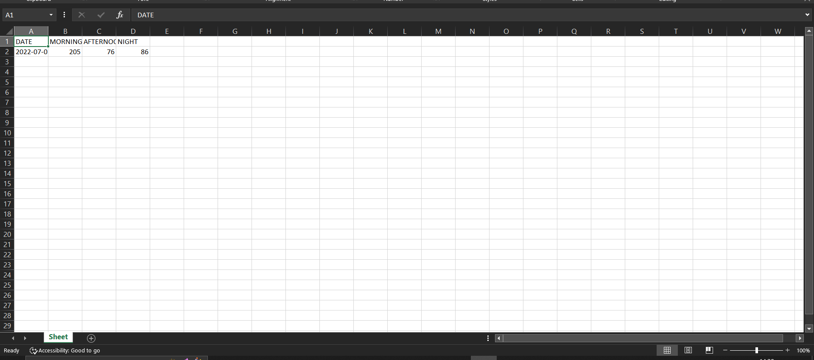
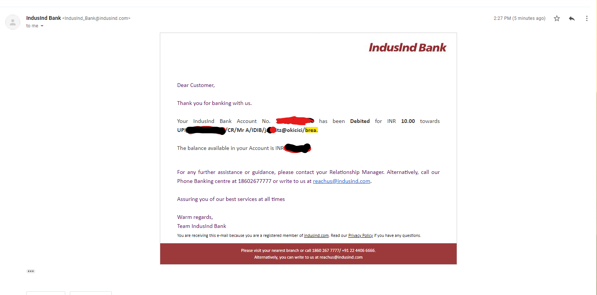

<h1>Kunjumonte Chilavukal </h1>

This is a tool which helps to calculate the daily food expenses. For implementing this, we used the Gmail API and with Python integration to upload the data to an Excel sheet.

<h2>How This Works</h2>
<ul>
    <li>Get an authorized token from Gmail API</li>
    <li>Fetching the messages from a particular sender using the methods from the Gmail API</li>
    <li>Segregating the fetched data with keywords like 'breakfast','lunch','dinner'</li>
    <li>Correspondingly updating the values in the excel file with the 'openpyxl' library</li>
</ul>
<h2>Product images</h2>

